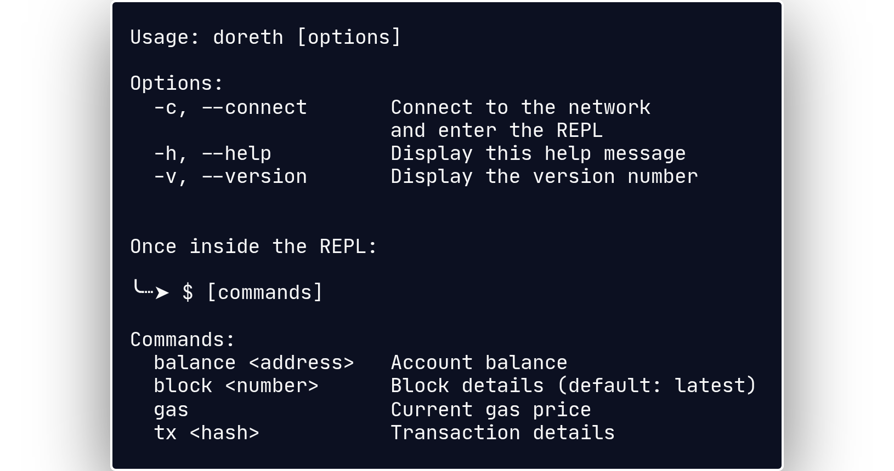

<div align="center">

<br>

[](https://github.com/bxavaby/doreth/commits/main)

───────────────────

### **doreth** $ ethereum explorer

<br>



</div>

<br><br>

## Install

Download the latest binary for your platform from [**Releases**](../../releases/latest) and add it to your PATH:

<br>

**Linux (x86_64):**
```
wget https://github.com/bxavaby/doreth/releases/latest/download/doreth-linux-amd64
chmod +x doreth-linux-amd64
sudo mv doreth-linux-amd64 /usr/local/bin/doreth
```

**Linux (ARM64):**
```
wget https://github.com/bxavaby/doreth/releases/latest/download/doreth-linux-arm64
chmod +x doreth-linux-arm64
sudo mv doreth-linux-arm64 /usr/local/bin/doreth
```

**macOS (Intel):**
```
curl -LO https://github.com/bxavaby/rnm/releases/latest/download/doreth-darwin-amd64
chmod +x doreth-darwin-amd64
sudo mv doreth-darwin-amd64 /usr/local/bin/doreth
```

**macOS (Apple Silicon):**
```
curl -LO https://github.com/bxavaby/doreth/releases/latest/download/doreth-darwin-arm64
chmod +x doreth-darwin-arm64
sudo mv doreth-darwin-arm64 /usr/local/bin/doreth
```

**Windows (AMD64):**
```
curl -LO https://github.com/bxavaby/doreth/releases/latest/download/doreth-windows-amd64.exe
chmod +x doreth-windows-amd64.exe
move doreth-windows-amd64.exe C:\Windows\System32\doreth.exe
```

**Windows (ARM64):**
```
curl -LO https://github.com/bxavaby/doreth/releases/latest/download/doreth-windows-arm64.exe
chmod +x doreth-windows-arm64.exe
move doreth-windows-arm64.exe C:\Windows\System32\doreth.exe
```

<br>

<details>
<summary><b>Build from source (alternative)</b></summary>

<br>

```
git clone https://github.com/bxavaby/doreth.git
cd doreth
go build -o doreth main.go
sudo mv doreth /usr/local/bin/
```

</details>

<br>
    
## Endpoint

I recommend setting up [infura](https://docs.metamask.io/services/get-started/infura/), then creating a `.env` file with the follwoing content:

```
URL="https://mainnet.infura.io/v3/"YOUR_KEY"
```

<br>

## REPL

Enter the environment:
```
doreth connect
```

<br>

Once in it, you can:

- `balance <address>` check account balance

- `block <number>` fetch block details

- `gas` print current gas price

- `tx <hash>` get transaction details

<br>

> [!NOTE]
> This implementation uses a minimal Read-Eval-Print Loop. <br>
> Type 'doreth connect', and you will know it.

<br>

<div align="center">
  
───────────────────

**[Report Bug](../../issues)** | **[Suggest Feature](../../issues)**

**MIT License © 2025 bxavaby**

</div>
